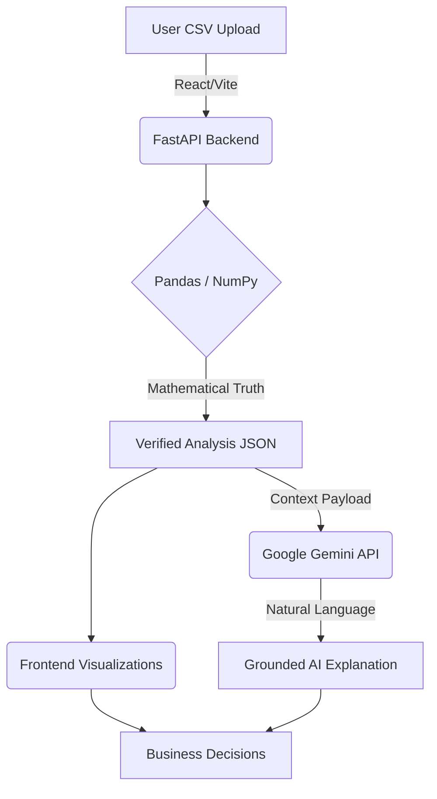

<div align="center">
  
  
  
  
  
  
  <br />
  <br />
  
  <h1>📊 DecisionLens AI</h1>
  
  <p>
    <strong>An AI-powered decision intelligence engine that transforms raw business data into traceable insights, deterministic scenario analysis, and actionable recommendations.</strong>
  </p>

  <p>
    <a href="#problem">Problem</a> •
    <a href="#solution">Solution</a> •
    <a href="#architecture">Architecture</a> •
    <a href="#getting-started">Getting Started</a> •
    <a href="#api-reference">API</a>
  </p>
</div>

<br />

## 🚨 The Problem

Business leaders are constantly overwhelmed by raw data in spreadsheets. It takes too much time to calculate key performance indicators (KPIs), identify meaningful trends, and translate those numbers into actionable decisions. 

While AI chat models hold promise, relying purely on large language models to "read" spreadsheets directly often leads to **hallucinations**—where the AI invents data or hallucinates mathematical aggregations that don't exist, completely destroying trust in the system.

## 💡 The Solution

**DecisionLens AI** solves this by enforcing a strict architectural boundary between **deterministic data processing** and **AI explanation**. 

We use Python (Pandas/NumPy) to calculate mathematically verified KPIs, trend aggregations, and deterministic insights. These verified calculations form a secure, traceable "context window" that grounds the Gemini AI model. Users can ask natural language questions and simulate business scenarios with absolute confidence in the underlying numbers.

***

## ✨ Key Features

- **⚡ Instant Business Dashboards:** Drag and drop a standard sales CSV and instantly view revenue, orders, AOV, and category/regional performance breakdowns.
- **🔍 Traceable Insights:** Deterministic backend rules generate insights with a transparent "Evidence Panel", showing users exactly which raw data points support the claim.
- **🤖 Grounded AI Assistant:** Ask questions about your business. Google Gemini is provided only with the verified context, acting purely as an explanation engine rather than a calculator.
- **📈 What-If Simulator:** Model scenario projections (e.g., +10% sales) using transparent, strictly deterministic algebraic mathematics.
- **📊 Dataset Comparison:** Upload multiple datasets side-by-side to visually compare period-over-period or region-over-region performance differences.

***

## 🏗️ Architecture



*Core Principle: Math is for calculation. AI is for explanation.*

***

## 🚀 Getting Started

### Prerequisites
- Node.js (v18+)
- Python (3.9+)
- Google Gemini API Key

### 1. Clone the repository
```bash
git clone https://github.com/VIJAYAPANDIANT/decisionlens-ai.git
cd decisionlens-ai
```

### 2. Backend Setup
```bash
cd backend
python -m venv venv
source venv/bin/activate  # On Windows: venv\Scripts\activate

pip install -r requirements.txt
cp .env.example .env
```
*Edit `.env` and configure `GEMINI_API_KEY` and `FRONTEND_URL=http://localhost:5173`.*

```bash
python -m uvicorn app.main:app --reload --port 8000
```

### 3. Frontend Setup
```bash
cd frontend
npm install
cp .env.example .env
# Edit .env: VITE_API_URL=http://localhost:8000
npm run dev
```

### 4. Test the App
Navigate to `http://localhost:5173` and upload the provided sample dataset located at:
📁 `sample-data/sales_data.csv`

***

## 🔌 API Reference

| Endpoint | Method | Description |
| :--- | :---: | :--- |
| `/api/health` | `GET` | Healthcheck endpoint to verify backend status. |
| `/api/analyze`| `POST`| Parses CSV via Pandas, returning aggregated JSON KPIs and deterministic insights. |
| `/api/ask` | `POST`| Queries Gemini AI against the verified JSON context payload. |

***

## ☁️ Deployment

DecisionLens AI is architected for immediate PAAS deployment.

**Frontend (Vercel/Netlify):**
- Build Command: `npm run build`
- Output Dir: `dist`
- Env: `VITE_API_URL`

**Backend (Render/Railway):**
- Start Command: `uvicorn app.main:app --host 0.0.0.0 --port $PORT`
- Env: `GEMINI_API_KEY`, `FRONTEND_URL`

***

## 🏆 Hackathon Context

- **Event:** Build Fast with AI 2026
- **Track:** PS-04 — AI Decision Engine for Business Data
- **AI Disclosure:** Antigravity (autonomous coding agent) was utilized for scaffolding and styling. Google Gemini API powers the grounded AI assistant.

### 👥 Team
- Rithika K
- Ranjini K
- Vijayapandian T

***
<div align="center">
  <sub>Built with ❤️ for Build Fast with AI 2026</sub>
</div>
